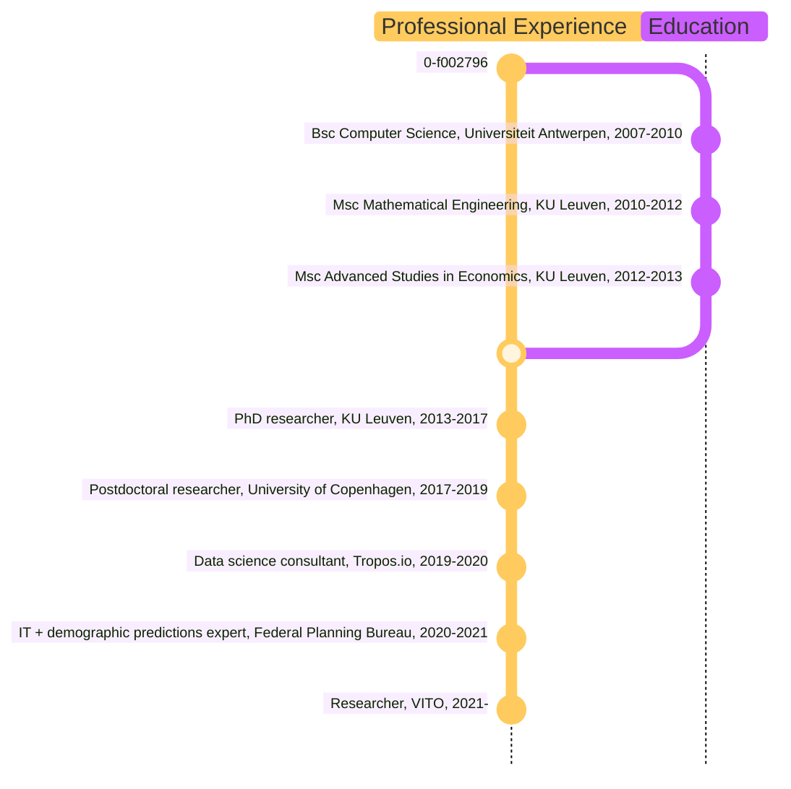

# Welcome

Welcome to my personal webpage!

# Biography

I am a researcher at the Flemish Institute of Technological Research (VITO) in Mol (Belgium). I am part of the Data & Analytics Competence Center.

My professional experience is summarized in this timeline:

